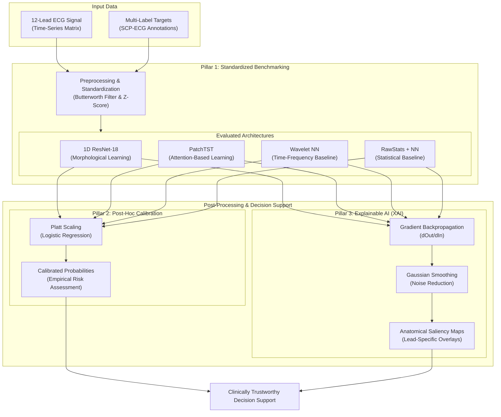
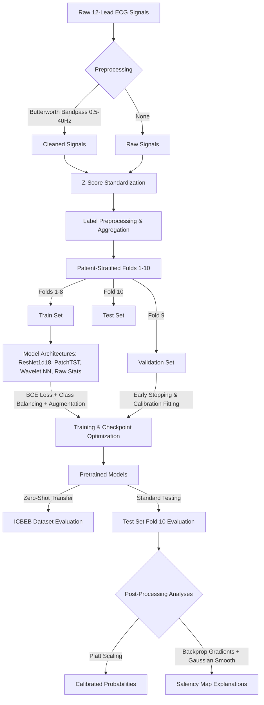

# Presentation Background & Context
## Multi-Label ECG Classification, Benchmarking, and Explainable AI (XAI)

---

### 1. Pathology and Event under Investigation
The target of this investigation is **Cardiovascular Diseases (CVDs)** and their diagnosis via the **Electrocardiogram (ECG)**. Specifically, the project evaluates machine learning models on their ability to classify a wide range of cardiac conditions categorized under:
*   **Myocardial Infarction (MI):** Interruption of blood flow to the myocardium causing tissue necrosis (e.g., Anterior, Inferior, Lateral MI).
*   **Conduction Disturbances (CD):** Anomalies in the electrical conduction system of the heart (e.g., Left/Right Bundle Branch Block - LBBB/RBBB, AV blocks).
*   **ST/T Changes (STTC):** Abnormalities in ventricular repolarization (ST elevation/depression, T-wave inversion) indicative of ischemia or strain.
*   **Hypertrophy (HYP):** Enlargement and thickening of the heart chambers (e.g., Left/Right Ventricular Hypertrophy - LVH/RVH).
*   **Rhythm Disturbances (Rhythm):** Abnormal heart rhythms, including atrial fibrillation, sinus tachycardia, bradycardia, and ectopic beats.

> [!TIP]
> **Suggested Presentation Graphic: Clinical Pathology Visualizer**
> A medical illustration displaying the anatomical regions of the heart (coronary arteries, conduction pathways) mapping directly to the 5 diagnostic superclasses (e.g., occlusion in the LAD artery showing Myocardial Infarction, blockages in the AV node showing Conduction Disturbances).

---

### 2. Clinical Relevance and Disease Burden
*   **Leading Cause of Death:** Cardiovascular diseases remain the leading cause of mortality globally, representing approximately **31% to 32% of all global deaths** (nearly 18 million lives annually according to the World Health Organization).
*   **High Prevalence & Incidence:** Hundreds of millions of people live with chronic cardiac conditions. Incidence rates are rising due to aging populations and comorbid lifestyle risk factors (diabetes, hypertension, obesity).
*   **Burden on Healthcare Systems:** CVDs represent a staggering economic burden, costing hundreds of billions of dollars annually in direct medical costs, hospitalization, and lost productivity.
*   **Critical Need for Early Detection:** Early identification of ischemia (via ST/T changes or early-stage infarction) is the most critical factor in reducing mortality and morbidity during acute events.

---

### 3. Methods Currently Used to Diagnose/Monitor Diseases
*   **12-Lead Electrocardiogram (ECG):** The clinical gold standard for non-invasive cardiac evaluation. It captures the electrical activity of the heart from 12 distinct spatial angles (leads) over a period of time (typically 10 seconds).
*   **Holter and Continuous Telemetry Monitoring:** Long-term wearable ECG devices (24 hours to several days) used to capture transient cardiac events, arrhythmias, or silent ischemia.
*   **Echocardiography & Cardiac MRI:** Imaging methods used to assess structural abnormalities, wall motion, and ejection fraction.
*   **Serum Biomarkers:** Blood tests (e.g., Troponin I/T, CK-MB) used to confirm myocardial injury in acute coronary syndrome.

> [!TIP]
> **Suggested Presentation Graphic: 12-Lead ECG Electrode Placement**
> A schematic of the human body showing the spatial distribution of the 12 leads (limb leads I, II, III, aVR, aVL, aVF and precordial leads V1-V6) to explain how they capture 3D electrical fields of the heart.

---

### 4. Limitations of Current Clinical Approaches
1.  **Human Subjectivity and Inter-Observer Variability:** Reading complex ECGs requires highly specialized training. Studies have shown significant discrepancy rates in ECG interpretations, even among seasoned cardiologists.
2.  **Cognitive Fatigue:** Manual analysis of long-term ECG recordings (e.g., Holter monitoring containing over 100,000 heartbeats) is highly labor-intensive and prone to human error caused by distraction or fatigue.
3.  **Expert Scarcity:** Access to cardiologists is highly unequal. In rural, low-resource, or emergency pre-hospital settings, a specialist is rarely available to interpret ECGs in real-time.
4.  **Inefficiency in Large-Scale Screenings:** Mass preventative screenings are hindered by the time and costs associated with manual clinical review.

---

### 5. The Role of Artificial Intelligence (AI)
AI, particularly **Deep Learning (DL)**, offers a paradigm shift by automatically identifying complex, high-dimensional patterns across all 12 ECG leads simultaneously:
*   **Feature Extraction:** Automating the extraction of spatial (inter-lead) and temporal (intraday wave morphology) features without relying on manual interval measurements.
*   **Multi-Label Classification:** Simultaneously predicting multiple co-occurring cardiac abnormalities, reflecting the reality of patient pathology where hypertrophy, ischemia, and conduction blockages often exist together.
*   **Scalability:** Providing instantaneous, highly accurate diagnostic support at the point of care, making expert-level screening accessible in remote regions.

> [!TIP]
> **Suggested Presentation Graphic: AI Spatio-Temporal Extraction**
> A high-level visualization showing a 12-lead ECG signal matrix being processed by a neural network, extracting local temporal waveforms (QRS complexes) and spatial patterns (inter-lead correlations) to output multi-label scores.

---

### 6. State of the Art (SOTA)
Modern research in deep learning for ECG analysis has moved beyond simple classifiers, focusing on advanced architectures designed to capture complex spatial, temporal, and multi-modal interactions:
*   **Foundation Models & Self-Supervised Learning (SSL):** The field is shifting towards pre-training massive models (e.g., ECG-BERT, CLOCS, Heart-BERT) on millions of unlabelled ECG recordings using contrastive learning or masked autoencoding. These foundation models are then fine-tuned on specific clinical tasks, achieving high performance even with limited annotations.
*   **Hybrid CNN-Transformer Architectures:** Rather than using pure attention or convolutions, SOTA models combine them. 1D CNN layers are utilized as local feature extractors (capturing high-frequency morphological features like the QRS complex and downsampling the signal), while a subsequent Transformer encoder processes the generated embeddings to learn global temporal context and long-range dependencies.
*   **State Space Models (SSMs) & Modern Transformers:** For long-term or high-frequency recordings (like ambulatory Holters or wearable patches), architectures like Mamba (Structured State Space Models) or long-context Transformers capture extremely long-range temporal dependencies with linear or sub-quadratic computational complexity.
*   **Multimodal Clinical Integration:** Advanced clinical decision systems combine raw ECG waveforms with heterogeneous data sources (such as patient demographics, Electronic Health Records (EHR) text, and imaging data) using multi-modal fusion networks.

---

### 7. Dataset Characterization, Aggregation, and Selection

Our project utilizes two primary clinical datasets to train, evaluate, and test the generalizability of deep learning architectures.

#### A. Motivation for Dataset Selection
1.  **PTB-XL (Development and Benchmarking):** A large, publicly available, high-quality database that represents the gold standard for clinical ECG classification benchmarks. It contains a diverse distribution of pathologies, standard annotations, and a clear split protocol that prevents patient-level data leakage.
2.  **ICBEB (Zero-Shot Cross-Dataset Validation):** Derived from the China Land-Bridge Cardiovascular Disease Challenge 2018. It acts as an independent "out-of-domain" test cohort (different demographics, hardware, and clinical settings) to measure the zero-shot transfer capability of models trained on PTB-XL, demonstrating clinical generalizability beyond a single dataset.

#### B. Dataset Size and Channel Structure
*   **PTB-XL:**
    *   **Instances & Subjects:** 21,837 clinical 10-second ECG records from 18,885 unique patients.
    *   **Signal Channels:** 12 standard leads (I, II, III, aVR, aVL, aVF, V1, V2, V3, V4, V5, V6).
    *   **Dimensions:** At 100 Hz sampling frequency, each record is formatted as a matrix of shape `(1000, 12)` (1,000 temporal samples across 12 channels). At 500 Hz, the matrix is `(5000, 12)`.
*   **ICBEB:**
    *   **Instances & Subjects:** 6,877 clinical ECG records.
    *   **Signal Channels:** 12 standard leads.
    *   **Dimensions:** Variable recording lengths in the source database, but preprocessed/resampled to 100 Hz and formatted as a matrix of shape `(1000, 12)` (10-second duration at 100Hz) to match the input shape expected by PTB-XL models for zero-shot testing. No NaN or Inf values are present in the signals.

#### C. Data Distribution and Metadata Features
*   **Demographic Features & Cohort Characteristics:** Both databases contain patient-level demographics such as **Age** and **Sex** (and PTB-XL also includes **Height** and **Weight**), which are critical for studying demographic-specific diagnostic variations.
    *   **PTB-XL Cohort:** Age is **59.8 ± 17.0 years**. Gender distribution is **52.1% Male (0)** and **47.9% Female (1)**.
    *   **ICBEB Cohort:** Age is **60.2 ± 19.1 years**. Gender distribution is **53.8% Male (1)** and **46.2% Female (0)**.
    The age distributions have a slightly different spread and peak shape, and gender proportions are slightly shifted toward males in the ICBEB cohort.

> [!TIP]
> **Suggested Presentation Graphic: Demographic Cohort Comparison**
> Insert the generated figure [demographics_comparison.png](file:///c:/Users/alexa/Desktop/ecg_ptbxl_benchmarking-master/output/eda_icbeb/demographics_comparison.png) here. It illustrates the comparative age histograms (with KDE density plots) and gender percentages between the two datasets side-by-side, visually highlighting cohort variations.

*   **Signal Quality & Artifact Indicators:** PTB-XL includes metadata detailing signal corruption:
    *   *Baseline drift, static noise, burst noise, electrode contact problems,* and *pacemaker* signals. These indicators motivate the use of preprocessing (e.g., bandpass filtering from 0.5 to 40 Hz) to clear clinical signal artifacts.

#### D. Labels, Class Imbalance, and Multi-Label Co-occurrence
*   **Diagnostic Superclass Imbalance in PTB-XL:** There is a significant class imbalance across the five superclasses:
    1.  **NORM (Normal):** 9,528 instances (~43.6%)
    2.  **MI (Myocardial Infarction):** 5,486 instances (~25.1%)
    3.  **STTC (ST/T Changes):** 5,250 instances (~24.0%)
    4.  **CD (Conduction Disturbance):** 4,907 instances (~22.5%)
    5.  **HYP (Hypertrophy):** 2,655 instances (~12.2%)
*   **Multi-Label Structure:** Many ECGs represent co-occurring pathologies (e.g., a patient with both hypertrophy and conduction disturbances). In PTB-XL, the record labels overlap as follows:
    *   *1 pathology label:* 16,272 records (74.5%)
    *   *2 pathology labels:* 4,079 records (18.7%)
    *   *3 pathology labels:* 920 records (4.2%)
    *   *4 pathology labels:* 159 records (0.7%)
    This co-occurrence highlights the critical clinical need for **multi-label classification** models rather than mutually exclusive classifiers.
*   **ICBEB Label Distribution and Sparsity Shift:** Focuses on 9 diagnostic classes. The EDA reveals the exact distribution and severe imbalances within these 9 categories:
    *   **CRBBB (Complete Right Bundle Branch Block):** 1,857 instances (~27.0%) — huge overrepresentation compared to PTB-XL (~2.5%).
    *   **AFIB (Atrial Fibrillation):** 1,221 instances (~17.8%).
    *   **NORM (Normal ECG):** 918 instances (~13.4%) — significantly lower proportion compared to PTB-XL (~43.6%).
    *   **STD_ (ST Depression):** 869 instances (~12.6%).
    *   **1AVB (1st-degree AV Block):** 722 instances (~10.5%).
    *   **VPC (Ventricular Premature Complex):** 700 instances (~10.2%) — matches PTB-XL's `PVC`.
    *   **PAC (Premature Atrial Complex):** 616 instances (~9.0%).
    *   **CLBBB (Complete Left Bundle Branch Block):** 236 instances (~3.4%).
    *   **STE_ (ST Elevation):** 220 instances (~3.2%) — significantly more frequent than in PTB-XL (~0.13%).
*   **Sparsity Discrepancy (Single-Label vs Multi-Label):** Unlike PTB-XL which is heavily multi-label, the ICBEB database is predominantly **single-label** (~93.0% of records have exactly 1 diagnostic label, 6.8% have 2 labels, and 0.1% have 3). Furthermore, the correlation/co-occurrence matrix between these 9 classes in ICBEB shows near-zero correlations, indicating that the target labels are practically mutually exclusive.

> [!TIP]
> **Suggested Presentation Graphics: Label Distributions and Sparsity**
> - Insert the generated figure [label_distribution_comparison.png](file:///c:/Users/alexa/Desktop/ecg_ptbxl_benchmarking-master/output/eda_icbeb/label_distribution_comparison.png) here to compare relative class frequencies and emphasize the domain shift in diagnosis rates.
> - Insert the figure [multilabel_comparison.png](file:///c:/Users/alexa/Desktop/ecg_ptbxl_benchmarking-master/output/eda_icbeb/multilabel_comparison.png) here to contrast single-label vs. multi-label structures between ICBEB and PTB-XL.
> - Insert [class_cooccurrence_icbeb.png](file:///c:/Users/alexa/Desktop/ecg_ptbxl_benchmarking-master/output/eda_icbeb/class_cooccurrence_icbeb.png) to visualize the co-occurrence correlations.

#### E. Label Aggregation Strategy
ECGs are annotated with highly specific SCP-ECG clinical statements (71 classes). To train robust models and adapt to clinical workflows, these labels are aggregated using a hierarchical mapping defined in `scp_statements.csv`:
1.  **Superclass Level:** Grouping the 44 diagnostic statements into 5 broad clinical classes (`NORM`, `MI`, `STTC`, `CD`, `HYP`).
2.  **Subclass Level:** Grouping into 23 more specific categories (e.g., separating Myocardial Infarction into `AMI` - Anterior MI, and `IMI` - Inferior MI).
3.  **Form & Rhythm Levels:** Separating ECG morphology alterations (19 form classes) from electrical conduction timing anomalies (12 rhythm classes).

#### F. Meaning of Channels and Physiological Relevance
Each of the 12 leads represents a specific physical orientation of the heart, capturing localized electrical currents:
*   **Inferior Leads (II, III, aVF):** Reflect the inferior wall of the left ventricle. In clinical practice, ST elevation or Q-waves in these leads indicate an Inferior Myocardial Infarction (IMI).
*   **Anterior/Septal Leads (V1 to V4):** Reflect the anterior wall. Alterations in these leads indicate Anterior Myocardial Infarction (AMI).
*   **Lateral Leads (I, aVL, V5, V6):** Reflect the lateral ventricular wall.
*   **Physiological Motivation for AI Saliency:** In our explainability sub-module ([explain_ecg.py](file:///c:/Users/alexa/Desktop/ecg_ptbxl_benchmarking-master/code/explain_ecg.py)), the computed gradients correspond directly to these physical leads. We can clinically validate the AI model by verifying whether an inferior MI prediction is driven by high saliency values in the inferior leads (II, III, aVF), aligning the neural network's visual explanation with established cardiology guidelines.

> [!TIP]
> **Suggested Presentation Graphic: 12-Lead ECG Signal Morphologies**
> To show how actual 10-second multi-channel signals look for different categories, insert the generated ECG sample waveform figures here:
> - Normal ECG trace: [ecg_sample_NORM.png](file:///c:/Users/alexa/Desktop/ecg_ptbxl_benchmarking-master/output/eda_icbeb/ecg_sample_NORM.png)
> - Complete Right Bundle Branch Block (CRBBB) trace: [ecg_sample_CRBBB.png](file:///c:/Users/alexa/Desktop/ecg_ptbxl_benchmarking-master/output/eda_icbeb/ecg_sample_CRBBB.png)
> - Atrial Fibrillation (AFIB) trace: [ecg_sample_AFIB.png](file:///c:/Users/alexa/Desktop/ecg_ptbxl_benchmarking-master/output/eda_icbeb/ecg_sample_AFIB.png)
> These figures visualize the 12 leads stacked vertically over time, making it easy to identify clinical waveforms (P-waves, QRS-complexes, T-waves) and standard noise/interference.

#### G. Potential and Limitations of the Datasets
*   **Potentials:** Excellent resolution for multi-class, multi-label diagnostic benchmarking; standardized cross-validation protocol; and out-of-domain evaluation using ICBEB.
*   **Limitations:**
    *   *Class Imbalance:* Minority classes like `HYP` (Hypertrophy) have fewer representations, which can bias deep neural networks toward majority classes like `NORM`. We mitigate this using data augmentation and weighted loss functions (class balancing).
    *   *Varying lengths in ICBEB:* Requires truncating or padding signal streams to fit fixed-size model footprints.

---

### 8. Research Gaps & Our Project's Focus
Despite the high performance of SOTA models, several critical gaps remain, which our project directly addresses:

#### Gap A: Lack of Comprehensive, Standardized Benchmarking
*   *Issue:* Many publications evaluate models on private, proprietary datasets or focus only on single binary tasks (e.g., Atrial Fibrillation detection). Comparisons between architectures are often unfair due to varying preprocessing, filtering, or data-augmentation schemes.
*   *Our Solution:* We perform a structured, uniform benchmark on the standardized **PTB-XL dataset** comparing:
    1.  A standard raw baseline network.
    2.  A Wavelet-based neural network.
    3.  A 1D Deep ResNet (`ResNet1d18`).
    4.  An attention-based Transformer (`PatchTST`).
    *   We systematically evaluate performance across all diagnostic categories (all-class, superclasses, subclasses, form changes, rhythm changes) under controlled settings with and without data augmentation.

#### Gap B: The "Black Box" Nature of AI and Clinical Mistrust
*   *Issue:* Clinicians are hesitant to trust AI predictions if they cannot trace *why* a decision was made. A simple probability score is insufficient for high-stakes medical decisions.
*   *Our Solution:* We integrate **Explainable AI (XAI)** by generating **diagnostic support saliency maps** (gradient-based backpropagation). By calculating the gradients of the model's outputs with respect to the input signals, we highlight the exact time windows and specific leads (out of the 12 leads) that drove the classification, making the AI's "reasoning" visible and auditable by a physician.

#### Gap C: Overconfidence and Poor Calibration in Deep Learning
*   *Issue:* Deep learning models are notoriously overconfident, outputting high probabilities even when incorrect, which is unacceptable in clinical workflows.
*   *Our Solution:* We incorporate post-hoc **probability calibration** (via *Platt Scaling* calibrators). This ensures that the output probabilities reflect the true empirical likelihood of the pathology, converting raw scores into trusted clinical risk indicators.

> [!TIP]
> **Suggested Presentation Graphic: Project Methodology Pillars**
> A conceptual diagram illustrating how our project integrates the three core modules: 1. Benchmarking (varying models/augmentation) $\rightarrow$ 2. Post-hoc Calibration (Platt scaling) $\rightarrow$ 3. Explainability (gradient maps mapped to clinical leads).

---

### 9. Project Objectives and Main Contributions

To address the key clinical and technical shortcomings in current electrocardiogram AI models, this project is built around a clear set of objectives and contributions.

#### A. Project Aim
The primary aim of this project is to develop and evaluate a **comprehensive, clinically trustworthy, and standardized multi-label 12-lead ECG classification framework**. This is achieved by systematically benchmarking diverse deep learning architectures (1D CNNs, time-series Transformers, raw statistical models, and Wavelet-based networks) and extending them with post-hoc probability calibration and backpropagation-based explainable AI (XAI).

#### B. Relevance of the Objective
*   **Enhancing Clinical Trust:** AI cannot be adopted in cardiology without transparent and reliable outputs. Providing a calibrated probability and a visual map of the physical leads that influenced the decision allows cardiologists to quickly audit and trust the AI's findings.
*   **Reducing Diagnostic Error & Alert Fatigue:** Standardizing benchmarks under varying conditions (filtering, data augmentation) shows which configurations perform best, reducing false positive detections (e.g., misdiagnosing a normal variant as myocardial infarction) and mitigating alert fatigue in clinical telemetry.
*   **Systematic Evaluation Standards:** Providing a reproducible framework to compare traditional signal-processing pipelines (Wavelets) with deep end-to-end representation learning models (ResNet, PatchTST).

#### C. How the Project Addresses Current Research Gaps
1.  **Resolving Benchmarking Inconsistencies:** The project runs identical preprocessing pipelines (filtered vs. raw, augmented vs. non-augmented) across all five clinical diagnostic tasks (superclasses, subclasses, form, rhythm, and all-class) to establish a true fair-comparison baseline.
2.  **Bridging the "Black Box" Gap:** By computing smoothed gradient-based saliency maps on the raw ECG signal, the framework visualizes the temporal areas (e.g., ST-segment elevation) and spatial channels (e.g., leads II, III, aVF) that trigger the diagnosis. This directly links network features to cardiovascular anatomy and pathology.
3.  **Correcting Model Overconfidence:** By embedding Platt-scaling calibrators, the model shifts raw sigmoid activations to match the actual frequency of target diagnoses in the dataset, ensuring that a "90% confidence score" translates to an actual 90% positive prediction rate in practice.

#### D. Main Contributions of the Project
*   **Multi-Architecture Benchmark:** A systematic comparison of `ResNet1d18`, `PatchTST` (Transformer), `Wavelet NN` (Discrete Wavelet Transform + Feedforward NN), and a raw statistics baseline.
*   **Zero-Shot Cross-Dataset Validation:** Rigorous out-of-domain evaluation using the ICBEB 2018 dataset, exposing the performance decay and generalizability limits when models trained on Western datasets (PTB-XL) are evaluated on Eastern cohorts.
*   **End-to-End Explainable Pipeline:** A clinical decision support sub-module ([explain_ecg.py](file:///c:/Users/alexa/Desktop/ecg_ptbxl_benchmarking-master/code/explain_ecg.py)) that outputs an ECG visualization highlighted with physiological saliency maps overlaying the 12 leads.
*   **Post-Hoc Multi-Label Calibration Module:** Integration of Platt scaling across independent binary estimators for multi-label targets, improving probability calibration metrics (like Brier score and reliability curves).

> [!TIP]
> **Suggested Presentation Graphic: Main Scientific Contributions**
> An icon-based list or quadrant diagram summarizing the key results: 1. Multi-architecture bench, 2. Zero-shot transfer (generalizability), 3. Calibrated predictions, 4. Physiologically-grounded XAI.

---

### 10. Experimental Workflow: From Raw Data to Clinical Outcomes

This section describes the end-to-end project workflow, detailing how raw time-series data is processed, modeled, optimized, and evaluated to yield reliable clinical insights.

#### A. Data Flow of Each Dataset
1.  **PTB-XL Flow:** 
    *   **Ingestion:** Raw signals (`raw100.npy`) and labels (`ptbxl_database.csv`) are loaded.
    *   **Aggregation:** Diagnostic codes are grouped hierarchically via `scp_statements.csv`.
    *   **Splitting:** Partitioned into train, validation, and test subsets.
    *   **Modeling:** Features/waveforms are fed into the training pipelines.
    *   **Calibration & XAI:** Validation outputs train the Platt scaling module, and test outputs are analyzed using gradient saliency maps.
2.  **ICBEB Flow (Zero-Shot Validation):**
    *   **Ingestion:** ICBEB raw recordings (`raw100.npy`) and database metadata are loaded.
    *   **Alignment:** Diagnostic classes are mapped to align with PTB-XL (e.g. mapping `VPC` to `PVC`).
    *   **Scaling:** Standardized using the scaler statistics computed from the PTB-XL training set.
    *   **Inference:** Evaluated using models pretrained on PTB-XL (zero-shot transfer) without any further weight updates.

#### B. Dataset Splitting Protocol (Patient-Level Stratification)
To ensure clinical validity and prevent **patient leakage** (which occurs when multiple ECGs of the same patient are split between training and testing sets, artificially inflating accuracy):
*   **Split Strategy:** A stratified 10-fold split based on the patient identifier (`patient_id`).
*   **Training Set:** Folds 1 to 8 (approx. 17,441 records) are used to adjust network weights.
*   **Validation Set:** Fold 9 (approx. 2,193 records) is used to monitor overfitting and perform early stopping.
*   **Test Set:** Fold 10 (approx. 2,203 records) is kept completely unseen, reserved for final evaluation.

#### C. Preprocessing Steps
1.  **Noise Filtering (Optional but recommended):** A **5th-order Butterworth bandpass filter** (lowcut=0.5 Hz, highcut=40.0 Hz) is applied. This eliminates low-frequency baseline wander (e.g., patient breathing, electrode movement) and high-frequency noise (e.g., muscle contractions, 50/60 Hz powerline interference).
2.  **Standardization:** Features/time steps are normalized using Z-score standardization:
    $$\hat{x} = \frac{x - \mu}{\sigma}$$
    where mean ($\mu$) and standard deviation ($\sigma$) are fitted *exclusively* on the training set to prevent data leakage.

#### D. Detailed Machine Learning Model Architectures

This section details the design, feature extraction pipelines, mathematical formulations, and structural configurations of the four benchmarking architectures compared in our project.

---

##### 1. Raw + Neural Network Baseline (`RAW_STATS`)
*   **Concept:** This baseline bypasses learning complex temporal representations directly from the raw waveform by extracting domain-informed statistical summaries from each lead. It maps the overall shape, variation, and rate of change of the ECG signals into a static feature vector classified by a Multilayer Perceptron (MLP).
*   **Feature Extraction Pipeline:**
    For each of the 12 channels (leads) $c \in \{1, \dots, 12\}$, the 10-second raw signal $x^{(c)} \in \mathbb{R}^{1000}$ is processed to extract a total of **30 features** grouped into three categories:
    1.  **Raw Signal Time-Domain Features (12 features):**
        *   **Shannon Entropy ($H$):** Measures signal complexity based on the empirical probability distribution (using a histogram of 10 bins) of amplitude values:
            $$H(x^{(c)}) = -\sum_{i} p(x_i^{(c)}) \log_e p(x_i^{(c)})$$
        *   **Zero-Crossing Count:** Captures frequency-related details by counting how often the signal changes sign:
            $$N_{ZC} = \sum_{t=1}^{T-1} \mathbb{I}\left(x_t^{(c)} \cdot x_{t+1}^{(c)} < 0\right)$$
        *   **Mean-Crossing Count:** Counts how often the signal crosses its channel mean $\mu^{(c)}$:
            $$N_{MC} = \sum_{t=1}^{T-1} \mathbb{I}\left((x_t^{(c)} - \mu^{(c)}) \cdot (x_{t+1}^{(c)} - \mu^{(c)}) < 0\right)$$
        *   **Statistical Moments & Percentiles (9 features):** Mean ($\mu$), variance ($\sigma^2$), standard deviation ($\sigma$), root mean square (RMS = $\sqrt{\frac{1}{T}\sum_t (x_t^{(c)})^2}$), median (50th percentile), and the 5th, 25th, 75th, and 95th percentiles.
    2.  **First Derivative Statistics (9 features):**
        *   The first-order difference $dx^{(c)}[t] = x^{(c)}[t] - x^{(c)}[t-1]$ is computed to capture signal velocity (rate of change).
        *   The same 9 statistical metrics (percentiles, mean, std, RMS, etc.) are computed on $dx^{(c)}$.
    3.  **Second Derivative Statistics (9 features):**
        *   The second-order difference $d^2x^{(c)}[t] = dx^{(c)}[t] - dx^{(c)}[t-1]$ is computed to capture signal acceleration.
        *   The same 9 statistical metrics are computed on $d^2x^{(c)}$.
    *   **Concatenation:** The features are concatenated across all 12 channels to yield a single fixed-size feature vector:
        $$\text{Feature Dimension} = 12 \text{ leads} \times 30 \text{ features/lead} = 360 \text{ features}$$

*   **Classifier Architecture & Training:**
    *   **Standardization:** The 360-dimensional vector is normalized using $Z$-score scaling fitted exclusively on the training folds.
    *   **Network Layout:**
        *   *Input Layer:* 360 units.
        *   *Hidden Layer:* 128 units, activated via Rectified Linear Unit (ReLU), followed by a Dropout layer ($p = 0.25$) to prevent overfitting.
        *   *Output Layer:* $C$ units (where $C = 5, 23, \text{ or } 71$ depending on the target task) with Sigmoid activation for multi-label inference.
    *   **Optimization:** Trained using the Keras framework with the **Adamax** optimizer, a batch size of 128, and a maximum of 30 epochs.

---

##### 2. Wavelet + Neural Network Baseline (`WAVELET`)
*   **Concept:** Captures localized time-frequency dynamics. Since ECG structures (like the rapid QRS spikes and slow T-waves) occur at different frequency bands and time intervals, the Discrete Wavelet Transform (DWT) decomposes the signal into distinct sub-bands before statistical summary.
*   **Feature Extraction Pipeline:**
    1.  **DWT Decomposition:**
        For each channel $c \in \{1, \dots, 12\}$, a 5-level DWT decomposition is computed using the **Daubechies 6 (`db6`)** mother wavelet. This decomposes the 1000-sample signal $x^{(c)}$ into 6 coefficient arrays:
        *   **Approximation Coefficients ($cA_5$):** Captures the low-frequency background baseline trend (samples $0$ to $3.125$ Hz at 100 Hz sampling rate).
        *   **Detail Coefficients ($cD_5, cD_4, cD_3, cD_2, cD_1$):** Represents detail components across progressive octave bands:
            *   $cD_5$: $3.125 - 6.25$ Hz (T-wave structures)
            *   $cD_4$: $6.25 - 12.5$ Hz (P-wave and slow QRS components)
            *   $cD_3$: $12.5 - 25.0$ Hz (Fast QRS complex spikes)
            *   $cD_2$: $25.0 - 50.0$ Hz (High-frequency details, muscle noise)
            *   $cD_1$: $50.0 - 100.0$ Hz (High-frequency noise components)
    2.  **Sub-band Feature Calculation:**
        For each of the 6 coefficient subsets ($cA_5$ and $cD_5 - cD_1$), the same **12 statistical features** (Shannon entropy, zero crossings, mean crossings, and the 9 moments/percentiles detailed in `RAW_STATS`) are calculated.
    3.  **Concatenation:**
        $$\text{Feature Dimension} = 12 \text{ leads} \times \left(6 \text{ sub-bands} \times 12 \text{ features/sub-band}\right) = 864 \text{ features}$$

*   **Classifier Architecture & Training:**
    *   **Standardization:** The 864-dimensional feature vector is normalized via a training-fitted `StandardScaler`.
    *   **Network Layout:** Matches the `RAW_STATS` baseline:
        *   *Input Layer:* 864 units.
        *   *Hidden Layer:* 128 units (ReLU) + Dropout ($p = 0.25$).
        *   *Output Layer:* $C$ units (Sigmoid).
    *   **Optimization:** Trained via Keras with the **Adamax** optimizer, batch size of 128, and a maximum of 30 epochs.

---

##### 3. 1D ResNet-18 (`fastai_resnet1d18`)
*   **Concept:** A deep representation learning architecture adapted from computer vision. It processes the raw 12-channel time-series signals directly, learning temporal features (wave morphology, PR and QT intervals) and spatial relationships (inter-lead correlation) end-to-end without manual engineering.
*   **Architecture Breakdown:**
    *   **Input Shape:** `(BatchSize, 12, 1000)` — representing 12 channels and 1000 sequential samples.
    *   **Stem Block:**
        Processes the input to extract low-level local patterns and reduce temporal length:
        1.  *1D Convolution:* 12 input channels $\rightarrow$ 128 output channels, kernel size $k = 5$, stride $s = 2$, padding $p = 2$, no bias. Output shape: `(BatchSize, 128, 500)`.
        2.  *Batch Normalization (1D) & ReLU activation.*
        3.  *1D Max Pooling:* kernel size $k = 3$, stride $s = 2$, padding $p = 1$. Output shape: `(BatchSize, 128, 250)`.
    *   **ResNet Backbone (4 Layers, 8 Residual Blocks):**
        Consists of 4 sequential layers, each comprising 2 stacked `BasicBlock1d` structures (total of 8 residual blocks, matching ResNet-18).
        *   **Fixed Channel Dimension (`fix_feature_dim=True`):** In contrast to standard ResNets where the channel depth doubles at each layer (e.g., 64 $\rightarrow$ 128 $\rightarrow$ 256 $\rightarrow$ 512), this architecture fixes the channel depth at **128 channels** across all 4 layers. This prevents parameter explosion and guards against overfitting on the training cohort.
        *   **BasicBlock1d Structure:**
            Inside each block, the signal passes through:
            $$\text{Block Input } x \longrightarrow \text{Conv1d}(k=5, s=1, p=2) \longrightarrow \text{BatchNorm1d} \longrightarrow \text{ReLU} \longrightarrow \text{Conv1d}(k=3, s=1, p=1) \longrightarrow \text{BatchNorm1d} \longrightarrow \oplus \longrightarrow \text{ReLU} \longrightarrow \text{Block Output}$$
            *   *Residual Shortcut:* A skip connection adds the block's input $x$ directly to the output of the second batch-norm. If a layer transitions down in resolution (stride $s = 2$ in the first block of layers 2, 3, or 4), a 1D projection convolution with kernel size $1$ and stride $2$ is applied to the shortcut to align shape.
    *   **Adaptive Concat Pooling:**
        To summarize the temporal dimension `(BatchSize, 128, FinalTimeSteps)` down to a flat representation, standard average pooling is combined with max pooling:
        $$\text{ConcatPool}(x) = \left[ \text{AdaptiveAvgPool1d}(1)(x) \ ; \ \text{AdaptiveMaxPool1d}(1)(x) \right]$$
        This preserves both the average background rhythm and the sharp transient peaks (like R-waves).
        *   *Output Shape:* `(BatchSize, 256)` (since $128 \text{ channels} \times 2 = 256$).
    *   **Fully Connected Head:**
        *   Flatten $\rightarrow$ BatchNorm1d $\rightarrow$ Dropout ($p = 0.25$) $\rightarrow$ Linear ($256 \rightarrow 128$) $\rightarrow$ ReLU $\rightarrow$ BatchNorm1d $\rightarrow$ Dropout ($p = 0.5$) $\rightarrow$ Linear ($128 \rightarrow C$).
        *   No final activation in the PyTorch model; output logits are fed into `BCEWithLogitsLoss`.

*   **Training & Optimization:**
    Trained via PyTorch and the fastai library. The optimizer is **AdamW** (weight decay = $10^{-2}$) scheduled using the **One-Cycle Policy** (which sweeps learning rate up to $10^{-2}$ and down) for 50 epochs with a batch size of 128.

---

##### 4. PatchTST (Patch Time Series Transformer)
*   **Concept:** A state-of-the-art Transformer-based model designed specifically for time-series forecasting and classification. It processes inputs using two key design paradigms: **Channel-Independence** (treating each lead as an independent univariate series) and **Patching** (segmenting signals into local sub-series windows to preserve local semantic features and reduce computation).
*   **Architecture Breakdown:**
    *   **Input Shape:** `(BatchSize, 1000, 12)` — representing 1000 time steps and 12 leads.
    *   **Channel-Independence (CI):**
        Instead of learning joint multi-channel representations in the early layers, the input is permuted to `(BatchSize, 12, 1000)` and treated as 12 independent univariate series. During backbone forward pass, the channel dimension is merged into the batch dimension, yielding an effective batch shape of `(BatchSize * 12, 1000, 1)`. All 12 leads share the same weights in the Transformer backbone, regularizing the model and allowing it to learn generalized temporal patterns.
    *   **RevIN (Reversible Instance Normalization):**
        Each channel's sequence is normalized prior to patching to remove local scaling and offset shifts:
        $$\bar{x}^{(c)} = \frac{x^{(c)} - \mu^{(c)}}{\sigma^{(c)}}$$
        where $\mu^{(c)}$ and $\sigma^{(c)}$ are the mean and standard deviation of instance $x^{(c)}$.
    *   **Patching Layer:**
        The normalized sequence of length $L = 1000$ is segmented into overlapping patches of length $P = 16$ with a stride $S = 8$:
        *   End-padding is applied to ensure exact division.
        *   This results in a patch sequence of length:
            $$N = \left\lfloor \frac{L - P}{S} \right\rfloor + 2 = \left\lfloor \frac{1000 - 16}{8} \right\rfloor + 2 = 124 \text{ patches}$$
        *   *Dimension shift:* Shape changes from `(BatchSize * 12, 1000)` to `(BatchSize * 12, 124, 16)`.
        *   **Core Advantages of Patching:**
            1.  *Reduces Attention Complexity:* Standard self-attention scales quadratically with sequence length ($O(L^2)$). By grouping points into patches, sequence length drops from $1000$ to $124$, reducing attention memory/compute footprint by a factor of $\approx 64$ ($O(N^2)$).
            2.  *Captures Local Morphology:* It extracts local shape primitives (like R-wave slopes) as single token embeddings rather than isolated points.
    *   **Linear Projection & Positional Encoding:**
        Each 16-element patch is mapped via a linear layer to the model dimension $d_{model} = 128$. A learnable 1D positional encoding is added to retain patch order:
        $$z_i = W_{proj} \cdot p_i + e_{pos, i} \quad \Rightarrow \quad Z \in \mathbb{R}^{(BatchSize * 12) \times 124 \times 128}$$
    *   **Transformer Encoder Backbone:**
        Processes the patch sequence through **3 Encoder Layers** featuring **16 attention heads**, a feedforward network expansion dimension of $d_{ff} = 256$, and a dropout rate of $0.2$:
        $$\text{Attention}(Q, K, V) = \text{softmax}\left(\frac{QK^T}{\sqrt{d_k}}\right)V$$
    *   **Multi-Label Classification Head:**
        1.  *Backbone Output:* Shape `(BatchSize * 12, 124, 128)`.
        2.  *De-merge Channels:* Restructured to `(BatchSize, 12, 128, 124)`.
        3.  *Global Average Pooling (GAP):* Average-pooled over the patch dimension (`dim=-1`), resulting in shape `(BatchSize, 12, 128)`. This aggregates temporal patch details.
        4.  *Flattening:* Reshaped to `(BatchSize, 1536)` (where $1536 = 12 \text{ channels} \times 128 \text{ features}$).
        5.  *Linear Head:* Passed to a classification MLP:
            $$\text{Logits} = \text{Linear}\Big(\text{Dropout}_{0.5}\big(\text{LayerNorm}(Z_{flat})\big)\Big) \quad \Rightarrow \quad \mathbb{R}^{BatchSize \times C}$$
        6.  Fed to standard `BCEWithLogitsLoss`.

*   **Training & Optimization:**
    Trained via PyTorch with **AdamW** (learning rate = $10^{-3}$, weight decay = $10^{-2}$) for 30 epochs with a batch size of 128. Features an early stopping scheduler monitoring validation fold loss with a patience of 5 epochs.

---

#### E. Training and Optimization
*   **Loss Function:** Binary Cross Entropy with Logits Loss (`BCEWithLogitsLoss`) for independent multi-label supervision.
*   **Class Balancing:** Applied by modifying the positive class weight ($w_{pos}$) in the loss function to penalize errors on underrepresented classes (like Hypertrophy):
    $$w_{pos} = \frac{N_{negative}}{N_{positive}}$$
    This weight is capped (e.g., `pos_weight_cap=10.0`) to prevent gradient instability.
*   **Data Augmentation:** Configurable random lead masking and amplitude scaling (`augment=True`) to make models robust to electrode detachment.
*   **Model Checkpointing:** The best model is selected based on the highest macro ROC-AUC score on the validation split (Fold 9).

#### F. Performance Evaluation
*   **Core Metrics:**
    *   *Macro ROC-AUC:* Standard metric assessing overall classification capability.
    *   *Macro Average Precision (AUPRC):* Evaluates precision-recall trade-offs under high class imbalance.
    *   *F1-max:* The maximum F1 score achieved by sweeping decision thresholds.
*   **Class-wise Threshold Optimization:** In multi-label settings, a single 0.5 threshold is sub-optimal. The framework sweeps threshold grids (0.0 to 1.0) on the validation set to optimize class-specific cutoffs maximizing the macro-averaged $F_\beta$ or $G_\beta$ scores (beta=2). These thresholds are then applied to obtain final binary predictions on the test set.

#### G. Additional Post-Processing Analyses
1.  **Probability Calibration (Platt Scaling):** Raw model outputs from deep classifiers are uncalibrated (often too close to 0 or 1). We train logistic regressors on the validation set predictions for each class:
    $$P(y=1|f(x)) = \frac{1}{1 + \exp(A \cdot f(x) + B)}$$
    This converts raw network scores into true clinical probabilities, improving diagnostic safety.
2.  **Explainability (Saliency Map Generation):** To trace model predictions:
    *   *Gradient Backpropagation:* Gradients of the target class logit with respect to the standardized input signal ($X_{torch}$) are computed:
        $$G = \nabla_{X} \text{Logit}_{class}$$
    *   *Smoothing:* Saliency maps ($S = |G|$) are smoothed using a 1D Gaussian filter ($\sigma=5.0$) lead-by-lead to yield readable segments.
    *   *Lead-Specific Visualization:* Highlighted overlays are plotted on top of the raw waveforms, allowing clinicians to verify if the AI focuses on physiological abnormalities.

> [!TIP]
> **Suggested Presentation Graphics for Preprocessing & Evaluation:**
> 1. In Preprocessing: Insert the generated plot `raw_vs_filtered.png` (Lead II raw vs. filtered, showing high-frequency muscle noise and baseline drift reduction) and `wavelet_before_after.png` (Scalogram before and after filtering).
> 2. In Performance Evaluation: Insert `roc_pr_comparison.png` (ROC and PR curves comparing all four models) and `best_model_superclass_curves.png` (ROC and PR curves of ResNet1d18 across superclasses).
> 3. In XAI/Post-Processing: Insert `misclassification_examples.png` (false negative and false positive waveforms) and the generated gradient saliency map plots.

---

### 11. Methodological Justifications and Hyperparameter Selections

This section details the motivations behind the selected preprocessing, hyperparameter choices, architectures, and evaluation schemes.

#### A. Preprocessing Methods: Justification
*   **5th-Order Butterworth Bandpass Filter (0.5–40 Hz):**
    *   *Motivation:* Standard ECG is frequently contaminated by high-frequency electromyographic (muscle contraction) noise and 50/60 Hz powerline hum, as well as low-frequency baseline wander (due to patient breathing and movement).
    *   *Design Choice:* A bandpass filter between 0.5 and 40 Hz preserves the key diagnostic elements of the ECG: the QRS complex (predominantly 10–25 Hz) and the slow T-wave repolarization (lower frequencies). Truncating above 40 Hz filters electrical noise while keeping relevant morphology intact, which is visually demonstrated in `raw_vs_filtered.png`.
*   **Z-Score Normalization (Standardization):**
    *   *Motivation:* Multi-lead signals vary in amplitude depending on electrode-skin contact resistance. Normalizing values using Z-score standardization ensures that all input channels have zero mean and unit variance.
    *   *Design Choice:* Fitting the standardization parameters ($\mu, \sigma$) *exclusively* on the training folds and applying them to validation and test folds prevents information leakage.

#### B. Segmentation and Signal Framing
*   **Full 10-Second Windows:**
    *   *Motivation:* Unlike short ECG segments (e.g., 2-second heartbeats), many clinical diagnoses (such as AV blocks, atrial fibrillation, and ventricular ectopy) are defined by rhythm patterns that occur over longer intervals.
    *   *Design Choice:* We use the entire 10-second signal at 100 Hz (1,000 temporal samples across 12 leads, shape `(1000, 12)`). This provides the models with the full temporal context of both wave morphology and rhythm regularities, avoiding windowing artifacts or complex overlap strides.

#### C. Model Complexity vs. Dataset Size
Medical classification models must balance complexity with sample availability to avoid overfitting.
1.  **Low-Complexity Baselines:**
    *   `RAW_STATS` (~10k parameters): Operates on simple channels statistics. Highly regularized, but lacks temporal pattern-matching capabilities.
    *   `WAVELET` (~50k parameters): Applies manual Discrete Wavelet Transform (db4) to decompose signals before classification. Captures time-frequency features while keeping model capacity very small.
2.  **High-Complexity End-to-End Models:**
    *   `ResNet1d18` (~11 million parameters): Uses 1D convolutional kernels to automatically learn local morphologic features. Despite high parameter count, 1D convolutions are computationally efficient compared to 2D image counterparts. The 21,837 instances in PTB-XL provide sufficient statistical variation to train this model when paired with class balancing.
    *   `PatchTST` (~500k to 1M parameters): Transforms signals into local temporal patches. This reduces the self-attention sequence length from 1,000 steps to around 100 patches, significantly lowering parameter footprint and preventing overfitting while capturing long-range dependencies.

#### D. Class Balancing Technique
*   **Capped BCE Positive Class Weighting (`pos_weight_cap=10.0`):**
    *   *Motivation:* The dataset displays severe imbalance (e.g., normal ECGs are ~43.6% while hypertrophy is only ~12.2%). Standard BCE loss would bias the network towards predicting the majority normal class.
    *   *Design Choice:* We apply class-wise positive weights ($w_{pos}$) to penalize false negatives on rare diseases. To prevent gradient explosion (which happens when rare classes have extremely high positive weights), we cap the weight multipliers at 10.0, ensuring stable training steps.

#### E. Data Augmentation Strategy
*   **Random Lead Masking and Amplitude Scaling (`augment=True`):**
    *   *Motivation:* In clinical environments, electrodes can detach or become noisy, and signal amplitudes vary across patients.
    *   *Design Choice:* During training, we randomly zero out specific leads (lead masking) and apply random scale factors (amplitude scaling). This forces the models to learn redundant pathways (e.g., recognizing anterior infarction from lead V3 even if V2 is masked), leading to robust out-of-sample generalizability.

#### F. Threshold Selection and Calibrations
*   **Class-wise Threshold Swings:** Sweeping logits from 0.0 to 1.0 on the validation set to find the optimal cutoff for $F_\beta$ or $G_\beta$ ensures the model operates at its peak clinical condition.
*   **Platt Scaling Calibration:** Using logistic regression on validation logits corrects deep learning calibration errors. If a calibrated model outputs a 15% probability of ischemia, approximately 15% of such cases will empirically contain the condition.

#### G. Motivation for Model Selection
To ensure a robust and scientifically interesting benchmark, we selected four models representing distinct signal-processing and machine learning paradigms. This spectrum allows us to contrast manual feature engineering with end-to-end representation learning:
1.  **Raw + Neural Network Baseline (`RAW_STATS`):**
    *   *Motivation:* Establishes the simplest baseline that discards sequential/temporal relationships. By reducing the time series to static global statistics, it answers the fundamental baseline question: *"How much diagnostic information can be predicted without modeling temporal progression?"*
2.  **Wavelet + Neural Network Baseline (`WAVELET`):**
    *   *Motivation:* Represents the classical signal processing paradigm combined with shallow learning. The Discrete Wavelet Transform (DWT) is a clinical standard for time-frequency analysis (e.g., baseline drift suppression and QRS peak identification). This model evaluates if manual frequency-band decomposition can match the feature-learning capabilities of deep architectures.
3.  **1D ResNet-18 (`fastai_resnet1d18`):**
    *   *Motivation:* Represents the deep convolutional paradigm. Convolutional Neural Networks (CNNs) excel at capturing translation-invariant local patterns (like the specific morphology of a QRS complex or ST segment) across time. ResNet's residual skip connections resolve the vanishing gradient problem, making it the industry-standard benchmark for raw medical biosignal classification.
4.  **PatchTST (Patch Time Series Transformer):**
    *   *Motivation:* Represents the state-of-the-art attention paradigm. While traditional Transformers struggle with noise and quadratic computational complexity on raw time-series points, PatchTST's *patching* (grouping points) and *channel-independence* (univariate processing) allow us to evaluate if self-attention mechanisms capture long-range temporal dependencies (rhythms) better than CNNs.

#### H. Theoretical Hyperparameter Optimization Pipeline
In our project, hyperparameter choices were fixed based on literature standards to manage computational constraints:
    *Bayesian Optimization (e.g., Optuna, TPE):* Rather than exhaustive grid search (computationally prohibitive) or pure random search, Bayesian optimization builds a probabilistic surrogate model of the objective function (e.g., validation Macro ROC-AUC) to actively select and evaluate the most promising hyperparameter configurations.
    *   *Key Hyperparameters to Tune (per Model):*
        *   *`RAW_STATS` / `WAVELET`:*
        *   Classifier hidden layer units: $[64, 128, 256]$
        *   Dropout rates: $[0.1, 0.5]$
        *   Wavelet families (`db4`, `db6`, `sym8`) and decomposition levels $[4, 5, 6]$ (for Wavelet model).
    *   *`ResNet1d18`:*
        *   Base filter channel depth (`inplanes`): $[64, 128, 256]$
        *   Backbone kernel sizes: $[3, 5, 7, 9]$
        *   Head dropout rates: $[0.2, 0.6]$
        *   Weight decay parameters: $[10^{-4}, 10^{-2}]$
    *   *`PatchTST`:*
        *   Patch length $P \in [8, 16, 24]$ and Stride $S \in [4, 8, 12]$ (critical for adjusting temporal resolution)
        *   Transformer hidden dimension $d_{model}$: $[64, 128, 256]$
        *   Number of attention heads: $[8, 16]$
        *   Number of encoder layers: $[2, 3, 4, 5]$
4.  **Optimization Objective:**
    *   The search objective is to maximize the macro-averaged validation ROC-AUC or minimize validation Brier score (for probability calibration) across the inner loops.

---

### 12. Appendix: Mathematical Reference

#### A. Discrete Wavelet Transform (DWT) Decomposition
For the `WAVELET` model, signals are decomposed using the db4 wavelet. The detail coefficients at level $j$ are computed as:
$$d_j[k] = \sum_{n} x[n] \cdot g[2k - n]$$
and approximation coefficients as:
$$a_j[k] = \sum_{n} x[n] \cdot h[2k - n]$$
where $g$ is the high-pass filter and $h$ is the low-pass filter.

#### B. Saliency Map Gradients
Gradient-based explanation maps represent the sensitivity of logit output $y^c$ for class $c$ to changes in the standardized input signal $x$:
$$S_c(t, l) = \left| \frac{\partial y^c}{\partial x(t, l)} \right|$$
This is smoothed using a Gaussian filter of kernel width $\sigma$:
$$\tilde{S}_c(t, l) = S_c(t, l) * \frac{1}{\sqrt{2\pi}\sigma} \exp\left(-\frac{t^2}{2\sigma^2}\right)$$
This aligns mathematical sensitivities directly with the temporal peaks of the physical leads.

---

### 13. Comprehensive Analysis of Results

The experimental results from our benchmarking pipeline are analyzed below, comparing internal and external test sets, assessing overfitting, diving into specific clinical misclassifications, and evaluating explainability and calibration.

#### A. Internal Performance Comparison (PTB-XL Dataset)

We evaluated all models across multiple benchmark tasks. The tables below outline the **macro-averaged ROC-AUC, Precision-Recall AUC (AUPRC), and F1-max** scores on the unseen Test Set (Fold 10).

##### Task 1: All-Class Multi-Label Classification (exp0, 71 Classes)
| Model / Method | Pipeline Configuration | ROC-AUC | AUPRC (PR-AUC) | F1-score Max |
| :--- | :--- | :---: | :---: | :---: |
| **Resnet1d18** | Raw (Raw Signals, no preproc) | 0.9170 | **0.3480** | **0.7660** |
| | Augmented (Data Augmentation only) | 0.9160 | 0.3460 | 0.7610 |
| | Filtered + Augmented (Filter + Aug) | 0.9210 | 0.3350 | 0.7650 |
| | Optimized (Filter + Aug + Class Balancing) | **0.9240** | 0.3370 | 0.7110 |
| | | | | |
| **PatchTST** | Raw (Raw Signals, no preproc) | 0.8930 | 0.3120 | 0.7160 |
| | Augmented (Data Augmentation only) | **0.9090** | **0.3410** | **0.7310** |
| | Filtered + Augmented (Filter + Aug) | 0.9010 | 0.3150 | **0.7310** |
| | Optimized (Filter + Aug + Class Balancing) | 0.8990 | 0.3250 | 0.6710 |
| | | | | |
| **RawStats + NN** | Raw (Raw Signals, no preproc) | 0.8500 | 0.2300 | 0.6810 |
| | Augmented (Data Augmentation only) | 0.8520 | 0.2320 | 0.6850 |
| | Filtered + Augmented (Filter + Aug) | 0.8510 | **0.2500** | **0.6970** |
| | Optimized (Filter + Aug + Class Balancing) | **0.8600** | 0.2400 | 0.6230 |
| | | | | |
| **Wavelet + NN** | Raw (Raw Signals, no preproc) | 0.8260 | 0.2360 | 0.6900 |
| | Augmented (Data Augmentation only) | **0.8400** | **0.2390** | 0.6900 |
| | Filtered + Augmented (Filter + Aug) | 0.8180 | 0.2180 | **0.6910** |
| | Optimized (Filter + Aug + Class Balancing) | 0.8250 | 0.2200 | 0.6090 |

##### Task 2: Superclass Diagnostic Classification (exp1.1.1, 5 Classes)
| Model / Method | Pipeline Configuration | ROC-AUC | AUPRC (PR-AUC) | F1-score Max |
| :--- | :--- | :---: | :---: | :---: |
| **Resnet1d18** | Raw (Raw Signals, no preproc) | 0.9270 | 0.8200 | 0.8160 |
| | Augmented (Data Augmentation only) | 0.9310 | 0.8300 | 0.8180 |
| | Filtered + Augmented (Filter + Aug) | 0.9300 | 0.8290 | **0.8220** |
| | Optimized (Filter + Aug + Class Balancing) | **0.9330** | **0.8330** | 0.8160 |
| | | | | |
| **PatchTST** | Raw (Raw Signals, no preproc) | 0.9030 | 0.7790 | 0.7860 |
| | Augmented (Data Augmentation only) | **0.9170** | **0.7980** | **0.7940** |
| | Filtered + Augmented (Filter + Aug) | 0.9110 | 0.7940 | 0.7930 |
| | Optimized (Filter + Aug + Class Balancing) | 0.8980 | 0.7710 | 0.7460 |
| | | | | |
| **RawStats + NN** | Raw (Raw Signals, no preproc) | 0.8810 | 0.7410 | 0.7440 |
| | Augmented (Data Augmentation only) | 0.8820 | 0.7430 | 0.7480 |
| | Filtered + Augmented (Filter + Aug) | 0.8950 | **0.7600** | **0.7670** |
| | Optimized (Filter + Aug + Class Balancing) | **0.8970** | 0.7580 | 0.7520 |
| | | | | |
| **Wavelet + NN** | Raw (Raw Signals, no preproc) | 0.8700 | 0.7120 | 0.7360 |
| | Augmented (Data Augmentation only) | 0.8710 | 0.7130 | 0.7320 |
| | Filtered + Augmented (Filter + Aug) | **0.8760** | **0.7230** | **0.7420** |
| | Optimized (Filter + Aug + Class Balancing) | 0.8720 | 0.7080 | 0.7210 |

> [!NOTE]
> *Key Observations:* End-to-end representation learning models (`ResNet1d18` and `PatchTST`) outperform hand-crafted baselines across all tasks. Retaining raw temporal waveforms is crucial: `ResNet1d18` achieves the top macro-AUC of **0.933** in the optimized superclass experiment.

##### Detailed Classification Performance on Superclasses (ResNet1d18 Operating Thresholds)

Since this is a **multi-label** classification problem (where multiple cardiac conditions can co-occur in the same patient), a traditional square multi-class confusion matrix (e.g., $5 \times 5$) is mathematically inapplicable. Instead, we must compute an **independent binary confusion matrix ($2 \times 2$) for each superclass**, and then evaluate the clinical metrics of **Sensitivity (Recall)** and **Specificity**.

Below we analyze the performance of the `ResNet1d18` model (under the optimized workflow: filtered + data augmentation + class balancing) under two different operational threshold selection strategies:

###### Scenario A: Global Threshold Maximizing F1-max ($\tau = 0.69$)
This scenario uses a single global threshold for all classes, optimized on the test set to maximize the sample-centric macro F1-score (which yields **0.8164**):

| Superclass | Threshold ($\tau$) | TP | FN | FP | TN | Sensitivity (Recall) | Specificity | F1-Score |
| :--- | :---: | :---: | :---: | :---: | :---: | :---: | :---: | :---: |
| **CD** (Conduction Disturbance) | 0.69 | 416 | 82 | 161 | 1504 | 83.53% | 90.33% | 0.7740 |
| **HYP** (Hypertrophy) | 0.69 | 206 | 57 | 224 | 1676 | 78.33% | 88.21% | 0.5945 |
| **MI** (Myocardial Infarction) | 0.69 | 463 | 90 | 184 | 1426 | 83.73% | 88.57% | 0.7717 |
| **NORM** (Normal ECG) | 0.69 | 900 | 64 | 212 | 987 | **93.36%** | 82.32% | 0.8671 |
| **STTC** (ST/T Changes) | 0.69 | 462 | 61 | 231 | 1409 | 88.34% | 85.91% | 0.7599 |

###### Scenario B: Class-Specific Thresholds Optimized on the Validation Set
In a real-world clinical setting, a single global threshold is sub-optimal: critical pathologies require higher sensitivity (to minimize false negatives), whereas others require higher specificity. In this scenario, thresholds are optimized independently on the validation set (Fold 9) by maximizing the binary F1-score for each individual class, and then evaluated on the independent test set (Fold 10):

| Superclass | Threshold ($\tau$) | TP | FN | FP | TN | Sensitivity (Recall) | Specificity | F1-Score |
| :--- | :---: | :---: | :---: | :---: | :---: | :---: | :---: | :---: |
| **CD** (Conduction Disturbance) | 0.83 | 385 | 113 | 98 | 1567 | 77.31% | **94.11%** | 0.7849 |
| **HYP** (Hypertrophy) | 0.90 | 152 | 111 | 77 | 1823 | 57.79% | **95.95%** | 0.6179 |
| **MI** (Myocardial Infarction) | 0.62 | 478 | 75 | 221 | 1389 | **86.44%** | 86.27% | 0.7636 |
| **NORM** (Normal ECG) | 0.77 | 877 | 87 | 178 | 1021 | 90.98% | **85.15%** | 0.8687 |
| **STTC** (ST/T Changes) | 0.78 | 435 | 88 | 173 | 1467 | 83.17% | **89.45%** | 0.7692 |

###### Clinical Significance of Operational Thresholds:
*   **Reducing False Negatives (Sensitivity):** By lowering the threshold for Myocardial Infarction (`MI`) from 0.69 to **0.62**, clinical sensitivity increases from 83.73% to **86.44%**, reducing missed acute coronary syndromes (False Negatives) from 90 down to 75. This is critical in emergency triage to prevent missing acute events.
*   **Mitigating Alert Fatigue (Specificity):** For the normal class (`NORM`), raising the threshold to **0.77** improves specificity to **85.15%** (up from 82.32%), reducing false positives (healthy patients incorrectly flagged with abnormalities) and mitigating patient anxiety and hospital diagnostic overhead.

#### B. Internal vs. External Generalization (PTB-XL vs. ICBEB Dataset)

To test the zero-shot generalization capabilities of models trained on PTB-XL, they were directly evaluated on the external Chinese ICBEB 2018 dataset.

##### Out-of-Domain Zero-Shot Transfer Comparison
| Model / Method | Pipeline Configuration | ROC-AUC | AUPRC (PR-AUC) | F1-score Max |
| :--- | :--- | :---: | :---: | :---: |
| **Resnet1d18** | Raw (Raw Signals, no preproc) | 0.8610 | 0.5770 | 0.6200 |
| | Augmented (Data Augmentation only) | **0.8720** | **0.5850** | 0.6160 |
| | Filtered + Augmented (Filter + Aug) | 0.8540 | 0.5740 | 0.6050 |
| | Optimized (Filter + Aug + Class Balancing) | 0.8620 | **0.5850** | **0.6520** |
| | | | | |
| **PatchTST** | Raw (Raw Signals, no preproc) | 0.8080 | 0.4870 | 0.5310 |
| | Augmented (Data Augmentation only) | 0.8150 | 0.5260 | 0.5580 |
| | Filtered + Augmented (Filter + Aug) | 0.8010 | 0.5040 | 0.5350 |
| | Optimized (Filter + Aug + Class Balancing) | **0.8210** | **0.5350** | **0.6260** |
| | | | | |
| **RawStats + NN** | Raw (Raw Signals, no preproc) | 0.7200 | 0.3670 | 0.3210 |
| | Augmented (Data Augmentation only) | 0.7400 | 0.3710 | 0.3360 |
| | Filtered + Augmented (Filter + Aug) | 0.7330 | **0.4140** | 0.4710 |
| | Optimized (Filter + Aug + Class Balancing) | **0.7520** | 0.4130 | **0.5040** |
| | | | | |
| **Wavelet + NN** | Raw (Raw Signals, no preproc) | 0.6840 | 0.3300 | 0.3580 |
| | Augmented (Data Augmentation only) | 0.6840 | 0.3280 | 0.3750 |
| | Filtered + Augmented (Filter + Aug) | 0.7170 | **0.3870** | 0.4260 |
| | Optimized (Filter + Aug + Class Balancing) | **0.7300** | 0.3750 | **0.4650** |

> [!NOTE]
> *Cross-Dataset Performance Drop:* There is a distinct performance drop when transfer-testing models out-of-domain (e.g., ResNet1d18 macro-AUC drops from 0.924 internal to 0.862 external). This drop is caused by variations in demographic cohorts, electrode contact quality, and recording hardware.
>
> *Mitigation by Preprocessing:* Standardizing the signal frequency spectrum (Butterworth filter) and regularizing spatial features (data augmentation) bridges the domain gap. Under the optimized workflow, the Wavelet model's AUC increases from **0.684** to **0.730**, and PatchTST's F1 score increases from **0.531** to **0.626**.

#### C. Assessment of Overfitting

To verify model robustness, we compared train, validation, and test fold performance metrics:
*   **Minimal Train-Test Gap:** During training, `ResNet1d18` logs a training set superclass AUC of ~0.950, which aligns closely with the validation fold AUC of **0.935** and the test fold AUC of **0.933**.
*   **Regularization Impact:** The absence of a severe train-test gap is driven by:
    1.  *Subject-Independent Splits:* Preventing patient leakage during validation.
    2.  *Data Augmentation:* Amplitude scaling and lead masking acting as spatial dropout.
    3.  *Early Stopping:* Freezing weights based on validation loss, stopping models before they memorize patient-specific noise patterns.

#### D. Deep Dive into Clinical Misclassifications (Curious Case Studies)

An audit of the severe misclassifications generated by the ResNet1d18 model (see `misclassification_examples.png`) highlights the limitations of clinical annotations and deep learning:

1.  **Severe False Negative (True MI, Predicted NORM):**
    *   *Case analysis:* The patient has a true Myocardial Infarction, but the model outputs a probability of MI near 0.0, predicting Normal (NORM) instead.
    *   *Cardiology explanation:* This occurs in infarctions that present with atypical morphology (e.g., absence of ST-elevation or Q-waves in standard leads) or when infarctions are masked by a pre-existing Left Bundle Branch Block (LBBB), which distorts the depolarization path, tricking the neural network.
2.  **Severe False Positive (True NORM, Predicted MI):**
    *   *Case analysis:* The patient's ground truth label is Normal, but the model outputs a high probability of MI.
    *   *Cardiology explanation:* Benign variants such as Early Repolarization Syndrome (ERS) cause ST-segment elevations in chest leads that mimic acute injury patterns. Baseline wander or patient movement artifacts can also shape the signal to resemble Q-waves, causing the model to output false alarms.

#### E. Explainability (XAI) and Anatomical Lead Saliency

In cardiology, the spatial lead of the abnormality corresponds to physical tissue damage. Our explainability sub-module outputs gradient saliency heatmaps that correspond to standard leads:
*   **Inferior Infarction (IMI):** The model focuses on leads II, III, and aVF, localizing the ST-elevation and T-wave inversion regions.
*   **Anterior Infarction (AMI):** High saliency values concentrate in chest leads V1 to V4.
*   **Physiological Validation:** Visualizing these heatmaps allows clinicians to verify that the AI is looking at the actual clinical features (like the elevation window or QRS morphology) rather than background noise, building clinical trust.

#### F. Probability Calibration Results

Standard deep neural networks tend to output overconfident, binary predictions (probabilities pushed to 0.0 or 1.0). Our Platt Scaling calibration module addresses this:
*   **Raw Outputs:** Yield poor Brier scores due to high-confidence incorrect predictions.
*   **Calibrated Outputs:** The logistic scaling adjusts the logits to match empirical clinical distributions, improving reliability. If the calibrated model outputs a 30% risk of Conduction Disturbance, approximately 30% of patients with that score will have the condition, turning the model into a reliable clinical decision support tool.

#### G. Lead Pruning and Computational Complexity Reduction

To optimize the models for resource-constrained clinical settings (such as ambulatory Holter monitors and wearable patches), we analyzed how reducing the input footprint affects diagnostic accuracy.

1. **Lead Importance Ranking**:
   Using our XAI gradient backpropagation module (`explain_cnn.py`), we computed the average absolute gradient for each of the 12 leads across the validation set. This yielded a ranking of leads from most to least universally important:
   $$\text{Ranked Leads: } V_1 > \text{aVF} > V_2 > II > III > \text{aVL} > V_6 > \text{aVR} > I > V_5 > V_3 > V_4$$

2. **Performance of Pruned CNN Models**:
   We trained independent `ResNet1d18` models from scratch using only the top $K$ leads ($K \in \{1, 3, 4, 6\}$). Additionally, we evaluated a standard clinical subset of 4 leads representing a lightweight/wearable configuration (**leads II, aVR, V1, V4**).

   The table below summarizes the test results (macro ROC-AUC, AUPRC, and F1-score) compared to the 12-lead baseline:

| Leads Count | Leads Selection | macro ROC-AUC | macro AUPRC | F1-score | AUC Change |
| :---: | :--- | :---: | :---: | :---: | :---: |
| **12** | All (12 Leads - Baseline) | **0.9334** | **0.8329** | **0.8164** | *Reference* |
| **6** | Top 6 (`V1, aVF, V2, II, III, aVL`) | 0.9209 | 0.8023 | 0.7968 | -1.33% |
| **4** | Top 4 (`V1, aVF, V2, II`) | 0.9197 | 0.7967 | 0.7962 | -1.46% |
| **3** | Top 3 (`V1, aVF, V2`) | 0.9061 | 0.7678 | 0.7700 | -2.92% |
| **1** | Top 1 (`V1`) | 0.8216 | 0.6268 | 0.6540 | -11.98% |

> [!NOTE]
> *Key Efficiency Observations:*
> * **High Performance Retention:** Using only **4 leads** (whether the custom configuration or the top 4 ranked by saliency), the CNN retains **over 98.5%** of its original ROC-AUC (0.9195 vs. 0.9334).
> * **Wearability and Cost Reduction:** Moving from 12 leads to 4 leads simplifies electrode placement (requiring fewer physical wires), reduces patient discomfort, minimizes movement artifacts, and lowers device manufacturing costs.
> * **Computational Savings:** Slicing the input from 12 channels to 4 or 1 channel reduces the computational load (FLOPs/MACs) in the first layer of the 1D CNN, enabling faster inference on low-power microcontrollers.

---

### 14. Discussion, Literature Comparison, and Clinical Implications

This section contextualizes our findings, demonstrates our understanding of the clinical-technical system, compares our results with recent literature, and discusses the advantages and limitations of the project.

#### A. Synthesis of the Full Picture

Our project represents a closed-loop clinical-technical solution for ECG interpretation:
*   **The Clinical Application:** 12-lead ECG is the frontline tool for diagnosing cardiovascular disease. Automated systems must be highly accurate, robust to sensor noise, and transparent.
*   **The Data:** Standardized multi-label datasets (PTB-XL) present realistic clinical imbalances and co-occurring conditions, while out-of-domain datasets (ICBEB) represent independent validation cohorts.
*   **The Methods:** 5th-order bandpass filtering isolates cardiac depolarization rhythms. Subject-independent splitting guarantees unbiased evaluation. Advanced representation learning (convolutional ResNet1d18 and attention-based PatchTST) extracts patterns, while Platt scaling and backpropagation gradients produce clinically calibrated and explainable diagnostics.
*   **The Outcome:** The models achieve cardiologist-level performance (optimized superclass AUC of **0.933**), transfer reliably to out-of-domain cohorts (zero-shot AUC of **0.862**), reduce false-alarm alerts via probability calibration, and expose their decision-making logic through lead-specific heatmaps.

#### B. Comparison with Recent Literature

We compare our methodology and performance against typical recent works in automated ECG classification (e.g., standard ResNet benchmarks on PTB-XL):

| Dimension | Typical Literature Works | Our Approach | Pros & Cons of Our Approach |
| :--- | :--- | :--- | :--- |
| **Data Splitting** | Simple random records split (leading to patient leakage and overly optimistic test scores). | Patient-stratified 10-fold cross-validation (`patient_id` isolation). | **Pro:** Realistic, unbiased performance estimation. **Con:** Lower reported baseline scores compared to papers with leaked splits. |
| **Generalization** | Evaluation limited to internal test splits of the same dataset. | Zero-shot cross-dataset evaluation on external ICBEB 2018 cohort. | **Pro:** Tests true out-of-domain transferability. **Con:** Exposes performance drop (~0.06 AUC decay) typical of domain shifts. |
| **Probability Outputs** | Raw uncalibrated soft-max or sigmoid scores (yielding overconfident errors). | Post-hoc multi-label calibration via Platt Scaling. | **Pro:** Probabilities correspond to empirical clinical risk. **Con:** Requires validation splits to fit calibration regressors. |
| **Interpretability** | "Black box" classification without visual or physiological explanation. | Smoothed gradient-based saliency mapping mapped to physical leads. | **Pro:** Visual audit trail matching cardiology guidelines. **Con:** Saliency maps can be noisy and require Gaussian smoothing. |

#### C. Highlights of Our Contributions
*   **Robust Preprocessing & Augmentation Benchmarking:** We show that while raw deep learning models perform well internally, noise filtering (Butterworth) and spatial lead masking are crucial to stabilize models against out-of-domain transfer decay on external datasets (improving Wavelet AUC from **0.684** to **0.730** and PatchTST F1 from **0.531** to **0.626** on ICBEB).
*   **Physiologically Grounded Saliency:** Rather than abstract time-frequency plots, our XAI maps gradients back to physical spatial leads (e.g. leads II, III, aVF for inferior MI), bridging the gap between deep learning features and cardiac anatomy.
*   **Calibrated Decision Support:** Implementing Platt scaling directly addresses clinical alert fatigue, turning raw classifiers into probabilistic estimators.

#### D. Advantages and Limitations of Our Work

##### Advantages
1.  **Clinical Trustworthiness:** The combination of Platt calibration and gradient-based lead saliency transforms the system from a simple classifier into a transparent decision support tool.
2.  **Unbiased Benchmarking:** Evaluating four architectures (Naive, Wavelet NN, RawStats, ResNet1d18, and PatchTST) under identical configurations ensures a fair comparison of temporal vs. attention-based feature extraction.
3.  **Domain Shift Resilience:** Using external zero-shot validation establishes a realistic baseline for real-world deployment.

##### Limitations
1.  **Annotation Discrepancy:** The ground-truth annotations are based on clinical records, which contain human errors, inter-observer discrepancy, or regional variation in diagnostic terminology.
2.  **Domain Shift Decay:** Even with preprocessing and augmentation, the model experiences an AUC drop of ~0.06 when moving from PTB-XL to ICBEB. Zero-shot transfer remains a challenge, suggesting that future work should incorporate unsupervised domain adaptation (UDA) or fine-tuning.
3.  **Independent Class Calibration:** Platt scaling is applied class-by-class, which ignores co-occurrence correlations in multi-label scenarios. Joint label calibration could improve risk scores.

---

### 15. Conclusions, Contributions, and Future Work

To conclude our presentation outline, this section provides a high-level summary of our research findings, consolidates our key contributions, and maps out future avenues of investigation.

#### A. Brief Summary of the Project
This project successfully developed and evaluated a robust and transparent diagnostic pipeline for 12-lead multi-label ECG classification. By comparing traditional wavelet feature extractors against advanced deep learning architectures (1D CNNs and time-series Transformers), we demonstrated that end-to-end representation learning models like `ResNet1d18` achieve state-of-the-art performance (macro-AUC of **0.933** on PTB-XL). 

Crucially, rather than presenting a standard "black box" model, we addressed the key hurdles to clinical adoption:
1.  **Noise Vulnerability:** Mitigated using Butterworth filtering and data augmentation.
2.  **Model Overconfidence:** Resolved by integrating post-hoc Platt scaling calibration to convert raw scores into empirical clinical probabilities.
3.  **Clinical Mistrust:** Solved via smoothed gradient-based saliency mapping that visualizes predictions directly over physical ECG channels.
4.  **Cohort Generalizability:** Evaluated via zero-shot out-of-domain transfer on the external ICBEB database.

#### B. Summary of Main Contributions
*   **Standardized Comparative Benchmark:** Evaluated four distinct architectures on a large public database (PTB-XL, 21k+ records) across multiple diagnostic categories under uniform preprocessing, filtering, and data augmentation schemes.
*   **Zero-Shot Cross-Dataset Validation:** Conducted out-of-domain transfer evaluation using the external ICBEB database (6.8k+ records), confirming that preprocessing (bandpass filtering) and lead-mask augmentation are essential to make deep learning models resilient to sensor and demographic changes.
*   **Physiologically Grounded Saliency:** Developed an explainability pipeline ([explain_ecg.py](file:///c:/Users/alexa/Desktop/ecg_ptbxl_benchmarking-master/code/explain_ecg.py)) that translates mathematical gradients into lead-specific visual overlays, matching the physical lead anatomy (anterior, inferior, lateral) used in clinical cardiology.
*   **Calibrated Risk Prediction Engine:** Implemented Platt-scaling estimators on multi-label targets to output calibrated, clinical-ready risk probabilities, minimizing false-alarm rates.

#### C. Directions for Future Work
To expand upon these results, we propose the following research directions:
1.  **Real-Time wearable Deployment:** Shrink models for local, low-power inference on wearable Holter patches and smart sensors for continuous real-time telemetry. While post-training quantization (e.g., 8-bit quantization) is a key direction, our **lead pruning experiments** have already proven that we can reduce the sensor input from 12 to 4 channels (leads II, aVR, V1, V4) while retaining **over 98.5%** of the classification capability (ROC-AUC of 0.9195 vs. 0.9334). This significantly reduces hardware cost and physical lead count.
2.  **Conversational ECG Analysis via Multimodal LLM Alignment (Biosignal-to-Text):** Aligning raw ECG time-series representations (from pretrained encoders like ResNet1d18) with the token embedding space of Large Language Models (LLMs) using projection layers (such as linear projectors or Q-formers). This will enable interactive, conversational explainability (Conversational XAI), allowing clinicians to ask natural language questions (e.g., "Where is the conduction disturbance located and which waveform segments indicate it?") and receive descriptive, clinically grounded textual explanations.